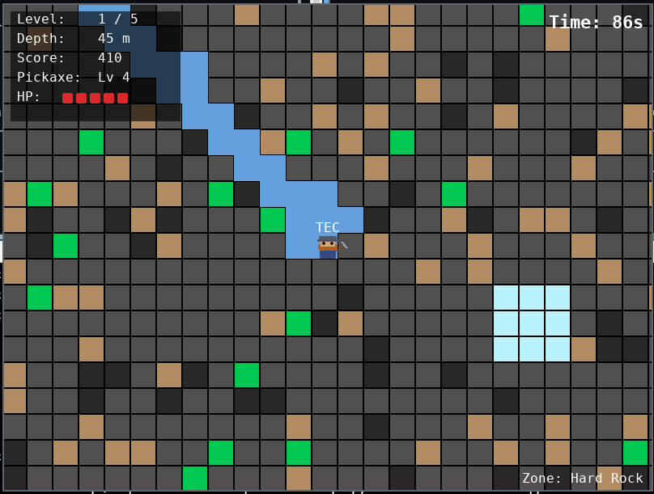

# Excavate Game

> ✨ **Vibe Coded** – this game was built by **T, E & C** together with [GitHub Copilot](https://github.com/features/copilot). Idea → Brainstorming → Code → done. 🎮

A 2D side-view mining game – developed by **TEC** (T, E & C) with Python + Pygame.
Dig through infinite layers, collect resources, avoid worms and cave hazards!



## 🌐 Play in your browser

**👉 [chriskujawa.github.io/excavate-game](https://chriskujawa.github.io/excavate-game/)**

No installation needed – runs directly in the browser thanks to [Pygbag](https://pygame-web.github.io/) (WebAssembly).

---

## 💻 Run locally

```bash
pip install pygame-ce
python main.py
```

## 🧪 Run tests

```bash
pip install pytest
python -m pytest tests/ -v
```

---

## 🎮 Controls

| Key | Action |
|-----|--------|
| `← →` / `A D` | Move (walking into a wall digs automatically) |
| `↑` / `W` | Dig up |
| `SPACE` | Jump |
| `↓` / `S` | Dig down |
| `Q` | Dig left |
| `E` | Dig right |
| `R` | Restart |
| `F11` | Toggle fullscreen |
| `ESC` | Quit |

---

## 🌍 The World

The world is **infinite vertically** – new layers are generated the deeper you dig.
The world **wraps horizontally** (Pac-Man style) – walk off one side and reappear on the other.
Same seed = same world every time.

### Depth Zones

| Zone | Depth | Material | Pickaxe |
|------|-------|----------|---------|
| 🟫 | 0–10 | Topsoil | Lv 1 |
| ⬛ | 10–30 | Rubble | Lv 2 |
| 🔲 | 30–60 | Hard Rock | Lv 3 |
| 🟪 | 60–90 | Granite | Lv 4 |
| ⚫ | 90–120 | Obsidian | Lv 5 |
| 🔵 | 120–150 | Basalt | Lv 6 |
| ⬜ | 150–170 | Quartz | Lv 7 |
| 💎 | 170–190 | Deep Crystal | Lv 8 |
| 🌑 | 190+ | Primal Core (∞) | Lv 9 |

### Hazards

- 💧 **Water caves** – HP drops slowly. Water flows downward and sideways!
- 🔥 **Lava caves** – instant death. Lava flows downward and sideways!
- 🧪 **Acid caves** – corrodes quickly. Acid flows too!
- The deeper you go, the more lava (5% near the surface → 80% at great depth)

### Enemies

- 🐛 **Worm (TEC-Stalker)** – appears from level 2. Follows your trail through the ground! Gets faster each level (up to ~89% of your speed).
- 🐍 **Cave Worms** – lurk in empty caves. Chase you on sight but can **only move through open air** – they can't dig through stone.

---

## 💎 Resources & Points

| Resource | Points | Where to find |
|----------|--------|---------------|
| 🖤 Coal | 5 | Surface |
| 🟤 Iron | 15 | Rubble / Hard Rock |
| 💚 Emerald | 40 | Hard Rock / Granite |
| ❤️ Ruby | 80 | Granite / Obsidian |
| 💙 Sapphire | 100 | Obsidian / Basalt |
| 🟡 Gold | 150 | Obsidian / Basalt |
| 🩶 Platinum | 250 | Basalt / Quartz |
| 🩷 Opal | 400 | Quartz / Deep Crystal |
| 💜 Amethyst | 600 | Deep Crystal / Primal Core |
| 🦴 **Fossil** | **1000** | **Quartz to Primal Core (very rare!)** |
| 💎 Giant Diamond | **WIN** | Depth 195, center of the world |

## ⛏ Pickaxe Upgrades

| Score | Level | Can mine |
|-------|-------|----------|
| 50 | Lv 2 | Rubble |
| 150 | Lv 3 | Hard Rock |
| 350 | Lv 4 | Granite |
| 700 | Lv 5 | Obsidian |
| 1200 | Lv 6 | Basalt |
| 2000 | Lv 7 | Quartz |
| 3000 | Lv 8 | Deep Crystal |
| 5000 | Lv 9 | Primal Core |

---

## 🏆 Highscore

- Top-5 leaderboard saved locally
- Shown on death **and** timeout
- "GAME OVER" on death, "ZEIT ABGELAUFEN!" on timer expiry
- New highscore → enter your name

---

## 🏗️ Project Structure

```
excavate-game/
├── main.py         # Entry point (pygbag-compatible, async)
├── game.py         # Game loop + states (5 states: start/play/gameover/highscore/level_complete)
├── world.py        # Procedural world – infinite depth, wrapping horizontal
├── player.py       # TEC – player logic, wrapping movement, all-direction digging
├── tile.py         # Tile types
├── camera.py       # Camera (follows player vertically and horizontally)
├── ui.py           # HUD, Start/Game-Over/Win screens, highscore display
├── highscore.py    # Local leaderboard (Top 5)
├── constants.py    # All constants (zones, resources, worm params, level system)
├── worm.py         # Worm (trail follower) + CaveWorm (air-only chaser)
├── touch_controls.py # Mobile/touch controls
├── assets/         # Screenshots and assets
├── tests/          # Pytest tests (189 passing)
└── .github/
    └── workflows/
        ├── ci.yml            # Run tests on every push
        └── deploy-pages.yml  # Auto-deploy to GitHub Pages
```

---

> Made with ❤️ by **T**, **E** & **C** — built with my kids

